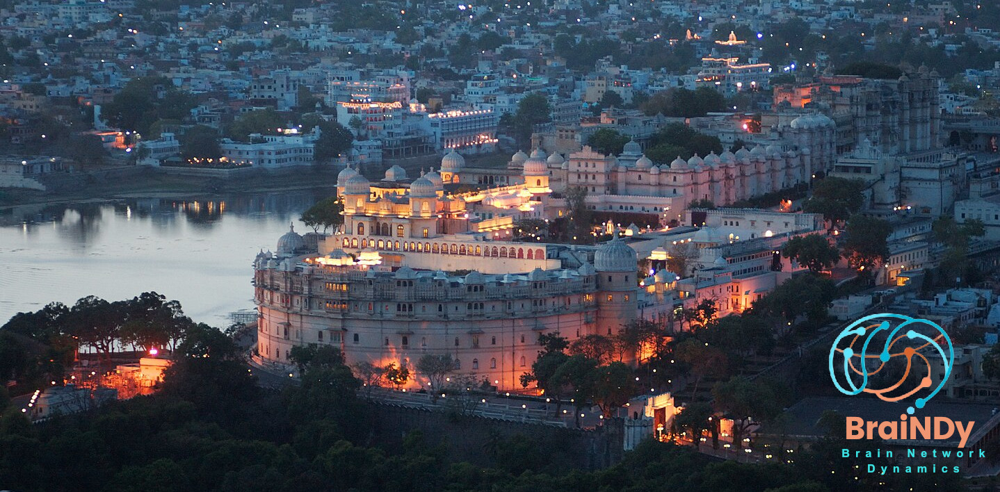
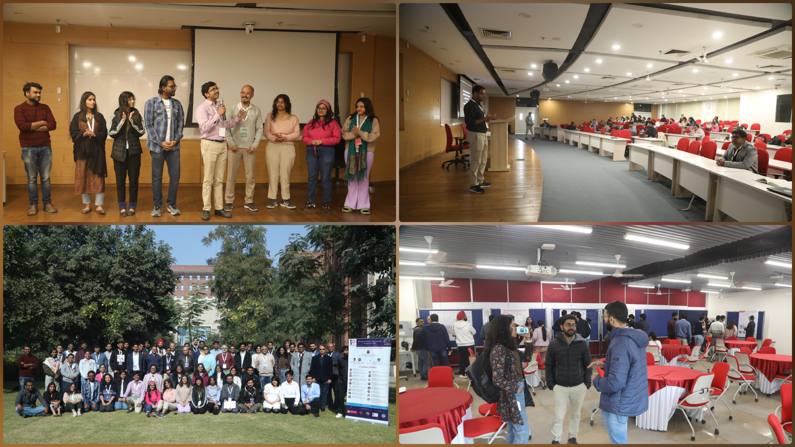
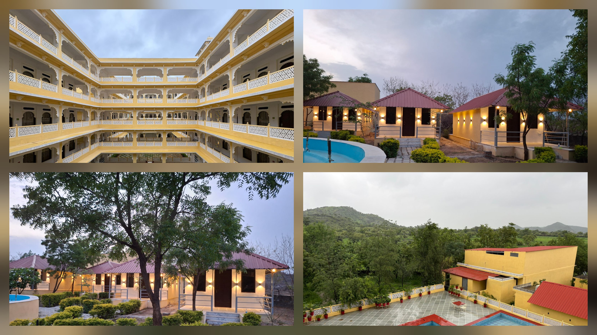
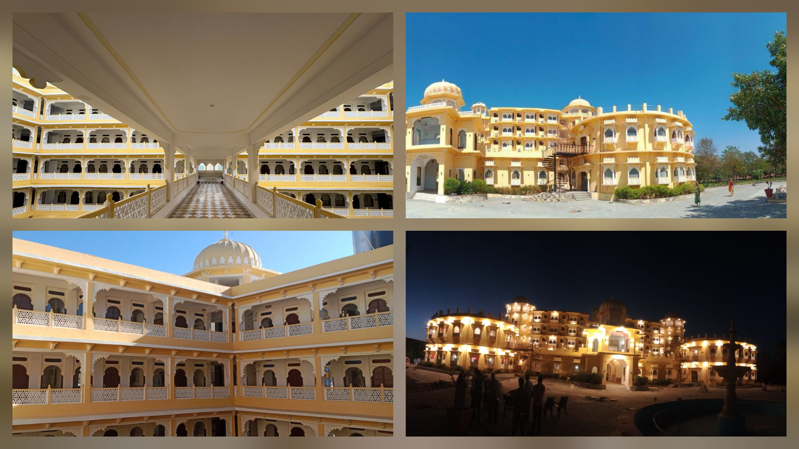

# About

Join us for the 2nd edition of the Brain Network Dynamics Meeting (BraiNDy 2026) at Udaipur from January 7-9, 2026. This annual event aims to foster the exchange of ideas and collaboration in the emerging field of brain dynamics, which encompasses dynamical systems, neuroscience, and related topics, utilizing both theoretical and empirical approaches.

The event will provide an informal setting, encouraging close interaction among researchers. We also welcome a limited number of participants who can register to attend and present their work in poster sessions.  This is an excellent opportunity for young researchers from various disciplines interested in brain dynamics to engage with established experts, share ideas, and explore potential collaborations.

<marquee direction="left" scrollamount="15" style="color: red;">Registrations will begin soon!</marquee>

## Venue

The event will be held at <a href="https://www.tripadvisor.in/Hotel_Review-g15359797-d33132050-Reviews-Sinclairs_Palace_Retreat_Udaipur-Kaloda_Udaipur_District_Rajasthan.html">Sinclairs Palace Retreat</a> in the city of <a href="https://en.wikipedia.org/wiki/Udaipur">Udaipur</a>. The city was founded by Maharana Udai Singh II in 1559, and is often called the ''City of Lakes'' for its picturesque water bodies like Lake Pichola and Fatehsagar. Known for its grand palaces, forts, and vibrant culture, Udaipur served as the capital of the Mewar kingdom and remains a major cultural and tourist center in Rajasthan.
 

There are several tourist attractions nearby. This includes <a href="https://en.wikipedia.org/wiki/Haldighati">Haldighati</a>, a narrow mountain pass, which is known for the famous Battle of Haldighati fought in 1576 between Maharana Pratap of Mewar and the Mughal army led by Man Singh. The pass, named after its turmeric-colored soil, stands as a symbol of Rajput valor and resistance.

If you have any queries, please reach out to us at <a href="mailto:braindy.meeting@gmail.com">braindy.meeting@gmail.com</a>.

<a href='http://www.freevisitorcounters.com'>Counters</a> 
