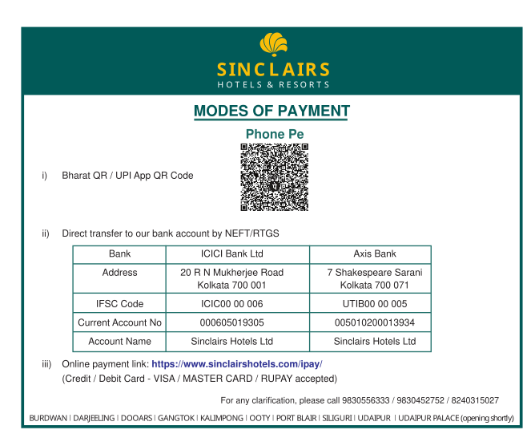

# Registration

Please go through this whole page carefully **before** registration and payment. 

## Charges

We need to charge a <b>nominal</b> amount of registration fee (considering the location and time) from every participant to cover for the organizational costs. 
Therefore, <b>before</b> filling out the registration form below, please complete the payment of the registration fees following the information below:

| Accomodation Type | Early registration (<ins>till Sep. 30, 2025</ins>) | Standard registration (<ins>till Nov. 15, 2025</ins>) |
| --------- | ----------------------- | --------------------- |
| Single occupancy | INR 17,040 / USD 200 | INR 20,040 / USD 230 |
| Double occupancy | INR 10,320 / USD 120 | INR 12,820 / USD 150 |
| Triple occupancy | INR 08,750 / USD 100 | INR 10,750 / USD 120 |

<b>Note 1</b>: The registration fee is <b>inclusive of all charges</b> and includes the stay at the Sinclairs Palace Retreat (with Wi-Fi and pool access!) for 7th and 8th January 2026. It also includes the Welcome-Kit, Breakfast, Lunch, Snacks, and Dinner for all days of the meeting.

<b>Note 2</b>: There is provision for a longer period of stay, subject to availability, beyond the conference dates at these rates. Please contact the event organizers from Sinclair Hotels directly with any such requests.

## Payment

Please pay the necessary charges using one of the methods listed below. Furthermore, please <b>download a copy of the invoice</b> and <b>make a note of the Transaction ID</b>.

<b>Note:</b> For wire transfers from international bank accounts, <b>please use the details of the "ICICI Bank Ltd" given in the picture above</b>, with <b>SWIFT Code: ICICINBB006</b> and <b>MICR Number: 700229002</b>.

## Link for Registration

If you have completed the payment of the charges as applicable, <b>register</b> for the meeting via the link <a href="https://forms.gle/cwRe8krcXUXHtmAW6">here</a>.

## Posters

We will have a dedicated time-slot for attendees to present their own <b>original</b> work as a poster. Therefore, if you are interested, please submit your abstract <a href="https://forms.gle/Wy2VPg1PD9st4RkN8">here</a> for consideration.

- 
Deadline for poster abstract submission: <b>September 30, 2025</b>.

- 
You <b>must be registered</b> (see above) for your abstract to be considered.

- 
We will verify your submission and send out notifications **after** September 30, 2025. We will **not** base our decisions on the scientific novelty/merit of your work - that will be left to the community and participants of the meeting.
 
- 
However, we <b>expect</b> that you will follow these <a href="https://drive.google.com/file/d/1fFk6OEFuXgJRLDz72eacgwfzeuSJWkSo/view?usp=sharing">instructions</a> for preparing the abstract since we aim to release a <b>Book of Abstracts</b> during the meeting.

- 
The LaTeX source files for preparing the abstract is available <a href="https://drive.google.com/file/d/1IpT1Q0632B4eXZSriJKq-jnQfbIpUGz9/view?usp=sharing">here</a>. While not recommended, if you do not wish to use LaTeX, please try and adhere to the styling format using the software/tool of your choice.
- 
We aim to accomodate <b>all</b> abstracts submitted to us which are prepared following the provided instructions. However, in the unlikely scenario where we have to reject an abstract for content/formatting issues, please note that we <b>cannot</b> refund your registration fees. In such cases, you are welcome to attend the meeting without presenting any poster.

